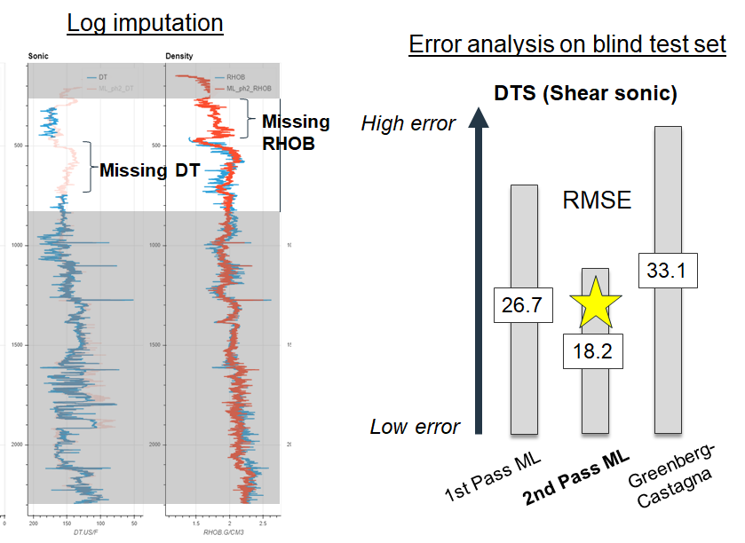
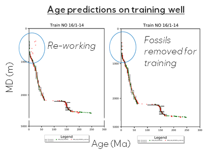
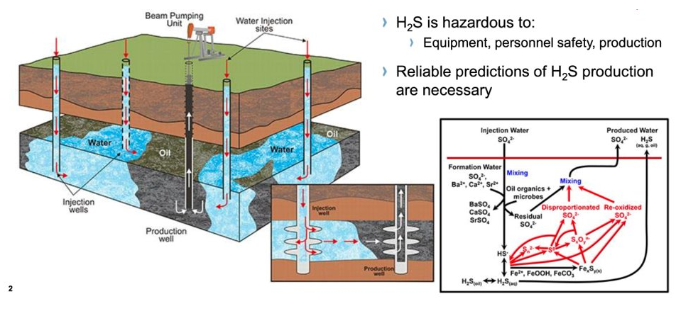
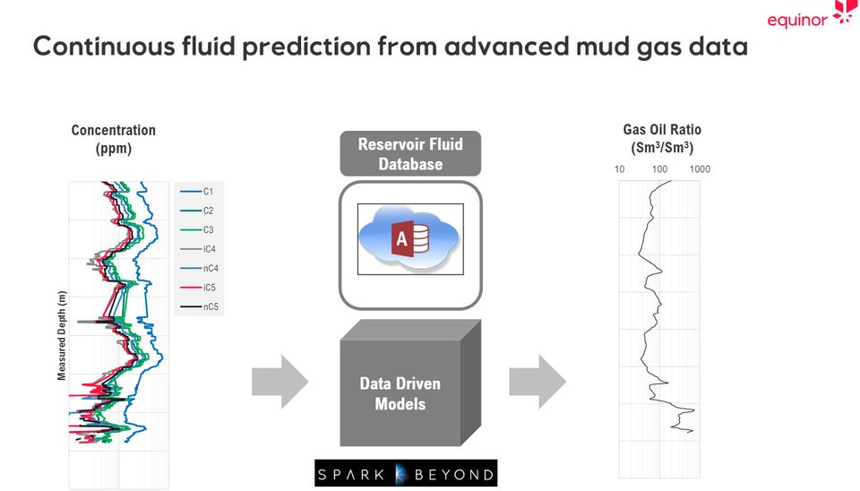
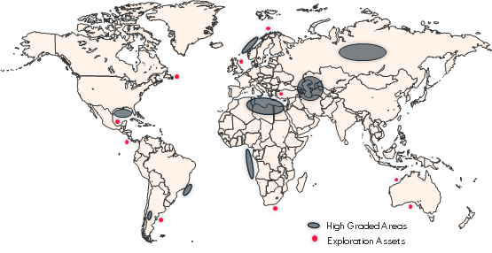

# Use cases

   |   |   
---|---|---
 |   |   

Machine learning has found a wide range of applications in the oil and gas industry, from predictive maintenance to reservoir optimization.

By leveraging large datasets and advanced algorithms, machine learning can help to improve operational efficiency, reduce costs, and make more informed decisions.

This section will name few of the ML projects developed by the Ideation Machine.